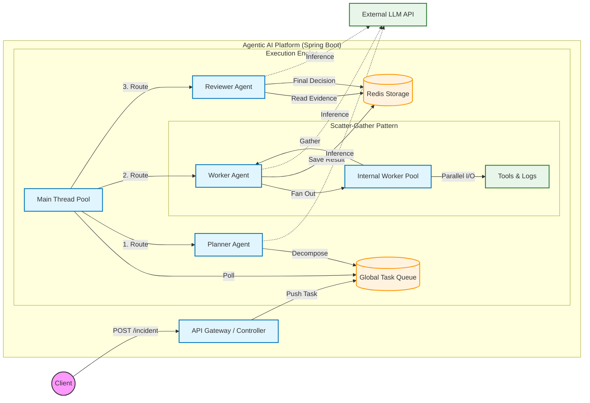

Agentic AI Platform: Design & Architecture
==========================================

1\. Overview
------------

The **Agentic AI Execution Engine** is a distributed, event-driven orchestration platform designed to execute complex, multi-step workflows using Large Language Models (LLMs).

Unlike fragile linear chains, this platform implements a **Planner-Worker-Reviewer** architecture to achieve reliability and scale.

*   **Planner:** Decomposes high-level goals into atomic, executable tasks.

*   **Worker:** Executes tasks in parallel using a **"Pull-Based"** model, where autonomous threads consume work from a shared queue.

*   **Reviewer:** Aggregates and validates worker outputs to synthesize a complete, verified final response.


_Key Goal: To decouple task reasoning (Planning) from task execution (Working), enabling high-concurrency processing for data-intensive AI applications._

2\. High-Level Architecture
---------------------------

The system follows a micro-kernel architecture where the core **Workflow Engine** is agnostic of the specific business logic, simply routing tasks between specialized agents.

### The Flow

1.  **Ingestion:** Client submits a request via REST API (IncidentController).

2.  **Queueing:** The request is wrapped in a Task object and pushed to a priority queue (Redis or In-Memory).

3.  **Orchestration:**

    *   **Planner Agent:** Decomposes the high-level intent into granular, executable steps.

    *   **Worker Agent:** Executes specific tools (e.g., Log Analysis, DB Fetch) in parallel.

    *   **Reviewer Agent:** Aggregates results, validates completeness against the plan, and synthesizes the final answer.

4.  **Coordination:** All state, intermediate results, and synchronization signals are stored in a shared IStorageBackend.

### Architecture Diagram



3\. Pluggable Infrastructure (Strategy Pattern)
-----------------------------------------------

One of the core design tenets is infrastructure agnosticism. The system defines strict interfaces (ITaskQueue, IStorageBackend) and provides two distinct implementations configurable via application.yml.

### A. Implementations & Justification

| Component | **In-Memory (RAM)** | **Redis (Distributed)** |
| :--- | :--- | :--- |
| **Use Case** | Local Development, Unit Testing, CI/CD | Production, High Availability, Horizontal Scaling |
| **Persistence** | Volatile (Lost on restart) | Persistent (AOF/RDB) |
| **Code Ref** | `InMemoryQueue`, `RamStorage` | `RedisQueue`, `RedisStorage` |

### B. Why is this Pluggable? (Strategy Pattern)

The system decouples core logic from infrastructure using strict interfaces (ITaskQueue, IStorageBackend), offering three key benefits:

1.  **Zero-Dependency Onboarding:**

    *   The app defaults to RAM mode (@ConditionalOnProperty) if Redis is missing. Developers can clone and run immediately without installing Docker or external services.

2.  **Fast & Isolated Testing:**

    *   Integration tests use RamStorage to run in milliseconds. This enables full end-to-end validation without flaky network calls or the overhead of test containers.

3.  **Future-Proof Scalability (Kafka/RabbitMQ):**

    *   Because Agents only interact with the ITaskQueue interface, the backend can be swapped for **Apache Kafka** or **RabbitMQ** with zero code changes to the business logic.

    *   **How:** Implement a KafkaTaskQueue class and update application.yml. This allows the system to leverage partition-based concurrency for massive scale while keeping the execution engine unchanged.


4\. Concurrency & Scalability Design
------------------------------------

The architecture employs a **Dual-Layer Concurrency Model** to balance high throughput with the strict rate limits of external LLM APIs.

### A. Layer 1: The Main Consumer Pool (Global Throttle)

The system runs a fixed number of "Task Executor Threads" (e.g., `workers=5`) that consume tasks from Redis.

*   **Role:** Controls **Global Throughput**. It strictly limits the number of tasks processed simultaneously across the server.

*   **The "LLM Hit Rate" Guard:** Generative AI APIs (OpenAI/Anthropic) have strict concurrency limits (e.g., "Max 50 req/min"). By fixing the worker count, we enforce a natural **Rate Limiter**. Even if 1,000 incidents trigger instantly, the system only opens 5 concurrent connections to the LLM, preventing `429 Too Many Requests` errors and protecting your API quota.


### B. Layer 2: The Worker Agent Sub-Pool (Latency Optimizer)

While the Main Pool limits _how many_ tasks run, the **Internal Worker Pool** optimizes _how fast_ they finish.

*   **Role:** Handles **Scatter-Gather Parallelism** for I/O-heavy tasks.

*   **Mechanism:** When a task requires analyzing 50 logs, the Worker Agent fans these out to its internal thread pool. This prevents "Head-of-Line Blocking," ensuring one heavy task doesn't monopolize a Main Thread for minutes while waiting on sequential API calls.

### C. Scaling Strategy

| Bottleneck Symptom | Diagnosis | Solution |
| :--- | :--- | :--- |
| **High Queue Backlog** | System is starved for **Throughput**. Incoming volume exceeds the processing rate of the Main Threads. | **Scale Main Pool** (Horizontal Scaling). Add more application nodes to consume tasks in parallel. |
| **Slow Individual Tasks** | System is starved for **Speed**. A single "heavy" task is processing sub-items sequentially because the internal pool is full. | **Scale Internal Pool** (Vertical Tuning). Increase `agents.worker.pool_size` to allow "bursty" parallel execution for heavy tasks. |

5\. Agent Coordination & Memory Store
-------------------------------------

Agents do not communicate directly. They communicate asynchronously via the **Shared State Store** (Blackboard Pattern).

### The "Manifest" Protocol

To coordinate between the **Planner** (who knows what needs to be done) and the **Reviewer** (who needs to know when to finish), we use a **Manifest**:

1.  **Planner:** Writes a list of expected tools to wf:{id}:manifest.

2.  **Workers:** Write their individual results to wf:{id}:res:{toolName}.

3.  **Reviewer:** Polling the store. It compares existing results against the Manifest.

    *   _If partial data:_ It goes back to sleep (no-op).

    *   _If complete:_ It triggers the final LLM synthesis.


This decoupling allows tasks to fail and retry without breaking the entire workflow state.

6\. Resilience: Idempotency & Error Handling
--------------------------------------------

Distributed systems must assume failure. The platform handles this via:

### A. Idempotency (The "Double-Spend" Protection)

In an event-driven system, the same message might be delivered twice (e.g., network timeouts).

*   **The Problem:** We don't want to pay for the Reviewer LLM call twice.

*   **The Solution:** The ReviewerAgent checks the wf:{id}:status before executing. If the status is already REVIEWING or COMPLETED, it immediately drops the task.


### B. Intelligent Retry & Backoff

Errors are classified into two types in the WorkflowEngine:

1.  **RetryableException:** (e.g., API Timeout, Rate Limit). The task is pushed back to the queue with an exponential backoff delay.

2.  **TerminalException:** (e.g., Invalid JSON, Missing Tool). The workflow is immediately marked as FAILED to prevent infinite loops.


### C. Dead Letter / Failed State

If a task exceeds max\_retries or hits a terminal error, the system explicitly updates the workflow status to FAILED and saves the error reason. This provides observability for the end-user.

7\. Feature: Granular Feature Flags
-----------------------------------

The system allows enabling/disabling individual agents via configuration (e.g., app.agents.planner.enabled=false).

### Why disable specific agents?

1. **"Dry Run" Mode (Safety & Cost):** By disabling the **Worker Agent**, we can test the Planner's logic without executing any actual tools. The system will generate the execution plan and queue the tasks, but no external APIs will be hit. This is useful for validating prompt changes without risking production data or incurring high LLM costs.

2. **Debugging & Isolation:** If the final answer seems incorrect, we can disable the **Reviewer Agent**. This stops the workflow after data collection, allowing us to inspect the raw, intermediate outputs from the Workers (stored in Redis) to determine if the issue lies with the tool data or the Reviewer's synthesis.

3. **Human-in-the-Loop:** We can disable the **Reviewer Agent** to create a "semi-autonomous" workflow. The system automates the tedious gathering of logs and database records (Workers), but halts before the final decision. A human operator can then review this collected evidence and make the final judgment call manually, rather than relying on the AI for the verdict.

8\. Getting Started & Demo ✨
-------------------

### Configuration (application.yml)

YAML

```yaml
app:
  storage:
    backend: ram  # Options: ram | redis
    default_ttl_sec: 3600
    ram:
      max_entries: 100000


  queue:
    backend: inmem  # Options: inmem | redis
    concurrency:
      workers: 8
      max_retries: 5
      backoff_strategy: exponential

  agents:
    workers:
      pool_size: 4
    planner:
      enabled: true

# --- REDIS CONFIGURATION ---
# Only required if app.backend=redis OR app.queue.type=redis
spring:
  data:
    redis:
      host: redis-stack
      port: 6379
      database: 0
      timeout: 10000ms

# --- LOGGING ---
logging:
  level:
    root: INFO
    # Set to DEBUG to see the internal state transitions
    com.artc.agentic_ai_platform: DEBUG
  pattern:
    # Includes TraceID/TaskID if MDC is set
    console: "%d{yyyy-MM-dd HH:mm:ss} [%thread] %-5level %logger{36} - [TraceId:%X{traceId}] %msg%n"

```

### Running the App 🏃

You can run the platform in two ways: **Dockerized** (recommended for full system simulation) or **Locally** (e.g., for quick Java debugging).

### Option A: Running with Docker 🐳  (Recommended)

This method automatically sets up **Redis** and the **Java Application** in a dedicated network using the helper scripts provided.

**Prerequisites** ✅

* Docker Engine running (via Docker Desktop, Colima, or native Linux).
* Docker Compose (optional, but good to have).

**1\. Start the Platform** 
Run the setup script. You can run the script in two modes `ram` and `redis`. 
By default, it runs in ram mode you can append --backend=redis to use redis for storage memory and task queue. This script creates the network, boots Redis (if needed), builds the Docker image, and starts the container.

Ensure, that the script is executable:
`chmod +x start-platform.sh`

**Start in default/RAM mode:**
`./start-platform.sh`

**Start in default/RAM mode:**
`./start-platform.sh --backend=redis` 

_Wait until you see the logs indicating ✅ System running ..._

**2\. Trigger an Incident** Run the trigger script to send a sample "Machine Overheat" incident to the API.

`chmod +x trigger_incident.sh`

`./trigger_incident.sh`

_Copy the `workflowId` from the JSON output (e.g., `550e8400-...`)._

**3\. Check Workflow Status** Poll the status of the workflow using the ID you just copied.

`chmod +x check_status.sh`

`./check_status.sh <WORKFLOW_ID>`

**🔧 Debugging Docker** If you need to inspect the system internals, use these commands:

| Action | Command |
| :--- | :--- |
| **View App Logs** | `docker logs -f my-agentic-app` |
| **View Redis Logs** | `docker logs -f redis-stack` |
| **List All Redis Keys** | `docker exec -it redis-stack redis-cli keys "*"` |
| **Open App Shell** | `docker exec -it my-agentic-app /bin/sh` |
| **Check Network** | `docker network inspect agentic-net` |
| **Stop Everything** | `docker rm -f my-agentic-app redis-stack` |

### Option B: Running Locally (No Docker)

Use this method if you want to debug code in your IDE. By default, the app will use **RAM Storage** and **In-Memory Queues**, so no external Redis is required.

**Prerequisites** ✅

*   **Java 21 SDK** installed.

*   **Maven** (optional, you can use the included `./mvnw` wrapper).

*   Port `8080` must be free.


**1\. Start the Application** Use the Maven wrapper to start the Spring Boot app directly.

`./mvnw spring-boot:run`

_Wait until the application starts on port `8080`._

**2\. Run the Helper Scripts** Since the API is available at `localhost:8080`, you can use the exact same scripts as the Docker method to test your local instance.

*   **Trigger an Incident:**

` ./trigger_incident.sh`

  *   **Check Status:**

`./check_status.sh <WORKFLOW_ID>`

9\. 🚀 Roadmap & Future Architecture
-------------------

This platform is designed to evolve from a static execution engine into a dynamic, self-healing ecosystem. The following architectural enhancements are prioritized:

*   **Dynamic Tool Discovery (Hot-Swapping)**

    *   **Goal:** Enable agents to acquire new capabilities at runtime without restarting the application.

    *   **Strategy:** Implement a "Tool Registry" service. Workers will dynamically load tool definitions (Python scripts, API specs) from an external source, allowing for zero-downtime upgrades and plugin-based extensibility.

*   **System-Wide Idempotency**

    *   **Goal:** Guarantee strict consistency and prevent duplicate side effects (e.g., double billing, redundant API calls) during network failures or worker crashes.

    *   **Strategy:** Extend the current deduplication logic from the Reviewer to the **Worker** and **Planner** agents. This ensures that retried tasks do not result in duplicate API calls, double-payments, or redundant sub-task generation.

*   **Self-Correcting Feedback Loops**

    *   **Goal:** Transform the Reviewer from a passive validator into an active quality gate.

    *   **Strategy:** Implement active rejection logic where the Reviewer can generate "Correction Tasks" and push them back to the Worker queue, creating a closed loop that continues until acceptance criteria are met.